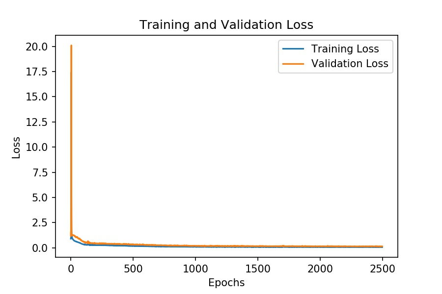
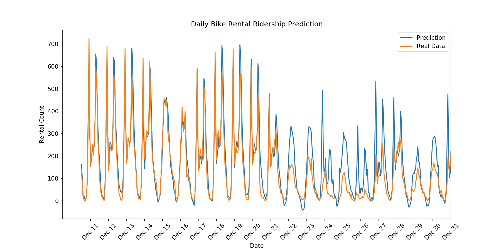

# Vanilla Neural Network 

Automatic bike share rental systems have become commonplace in many cities. Ridership is tightly correlated to weather conditions, date, and time of day. This repository is an attempt to illustrate the building blocks of a basic neural network through the lense of a model that predicts bike rental ridership. This project was part of Udacity's Deep Learning Nanodegree and uses a dataset<sup>[[1]](#1)</sup> from the University of Porto, Portugal. 

**Note:** This model does not use Pytorch or other frameworks. Feel free to see if you can improve on the predictions using more depth or other methods.   

### Navigation
* [Running Notebook Locally](#installing_locally)
* [Data Preparation](#data_prep)
* [Model Architecture](#model_arch)
* [Results](#results)
* [References](#referances)

<a id='installing_locally'></a>
## Installing Locally
If you would like to tinker feel free to install locally and make it your own.

1. Install dependencies - I generally use Conda for my environment and package management. 

	>`conda install -c conda-forge jupyterlab`  

	>`pip install requirments.txt` 

2. Dataset - Hourly and daily data in `csv` format is located in the `/datset` folder. A `Readme.txt` file explains how the data is formated. 

3. The following Jupyter notebook uses the `vanilla_n_class.py` file:
    * `Predicting_bike_sharing.ipynb` Jupyter notebook 
 
<a id='data_prep'></a>
## Data Preparation
First we import the data using Pandas and take a look at the first 5 records. Each row represents a one-hour data record. Each column will represent the category that we are going to process. However, in order for us to efficiently use the data in our neural network we need to do some preprocessing. Notice that we have a record count, datetime and a bunch of categorical data. Once we import the data...
``` python
    data_path = 'dataset/hour.csv'
    ride_data = pd.read_csv(data_path)
    ride_data.head()
````

<p align="center">

</p>

we can adjust the categorical data fields. The Pandas function `pd.get_dummies()` will handle the heavy lifting for us. Once we adjust the categorical data we will drop the unwanted categories like `instant` and `dteday`. We can then normalize the data.
<p align="center">

</p>

We will normalize the data by calculating the mean and standard deviation of each category and storing those variables in a dictionary for later. All continuous data records will be normalized for ease of processing.
<p align="center">

</p>

<a id='model_arch'></a>
## Model Architecture
We have constructed a 2-layer neural network (MLP) with 59 input nodes, 10 hidden nodes, and 1 ouput node. The 59 input nodes represent the features of our model with a target of `cnt`. We are trying to predict the number of rentals for a particular hour based on weather, temperature, etc. 
<p align="center">

</p>

<a id='results'></a>
## Results

After tuning the model we visualize the training and validation losses to make sure we are not overfitting our model. 
<p align="center">

</p>

Finally we can compare our prediction with actual data. You will notice that the model does a decent job at predicting rental amounts through December 21. It then overpredicts the amount of rentals needed. Can you think why this may be happening?

The model was trained on almost 2 years of historical data. From December 22 to December 31 the model overestimates. This could be from the fact that the weather was quite different in the training dataset as it is during the same days of the test set. Perhaps the weather was cooler or not as condusive for riding a bike at this time in the test set. If the weather was condusive for riding in the training set, the model would over estimate. This is just a hypothesis and warrants further investigation. More historical data would be needed to better tune the model but this is a good start. 
<p align="center">

</p>

## References

[1]<a id='1'></a> Fanaee-T, Hadi, and Gama, Joao, "Event labeling combining ensemble detectors and background knowledge", Progress in Artificial Intelligence (2013): pp. 1-15, Springer Berlin Heidelberg, doi:10.1007/s13748-013-0040-3.